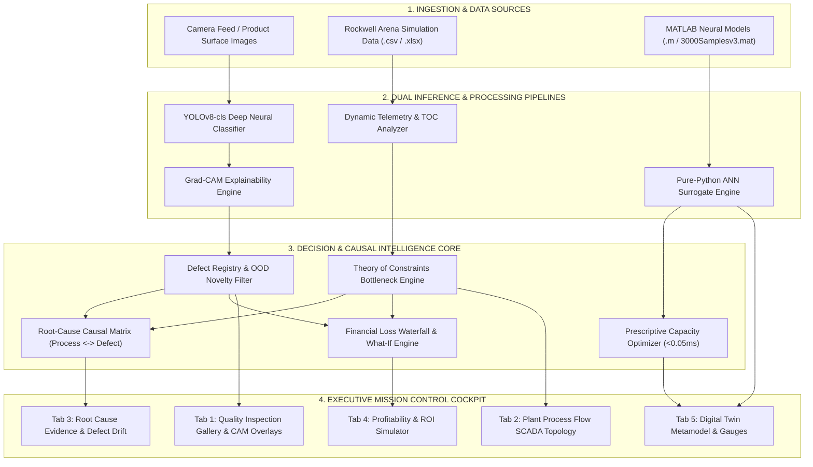
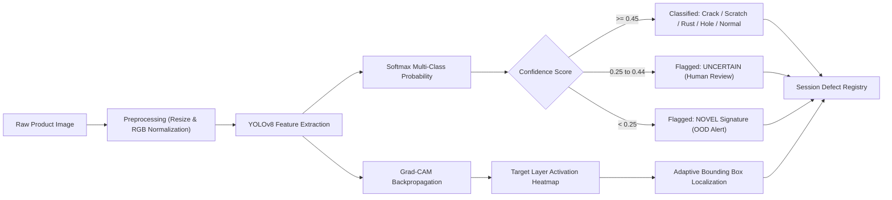
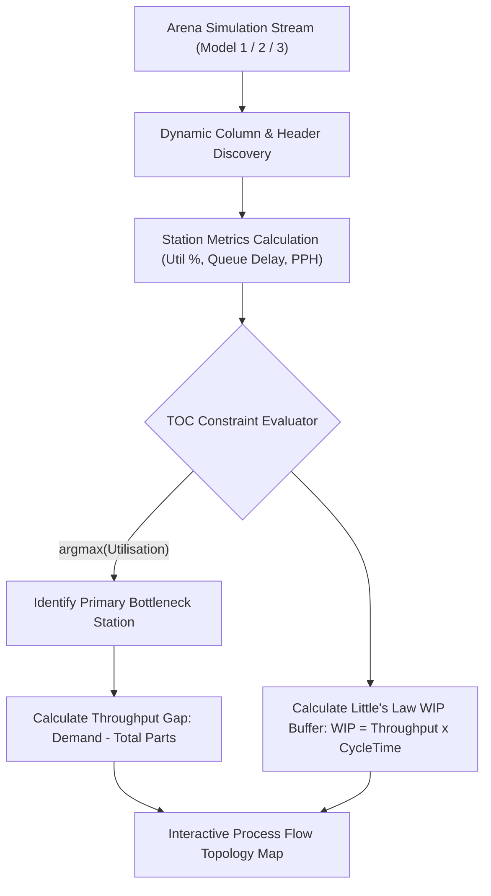
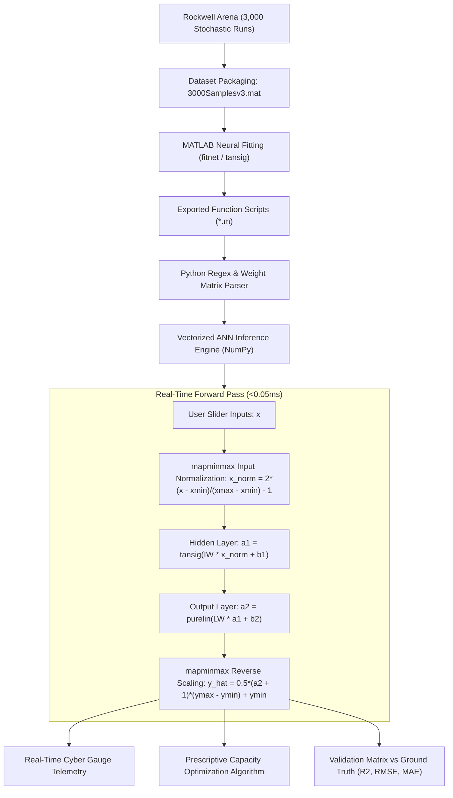
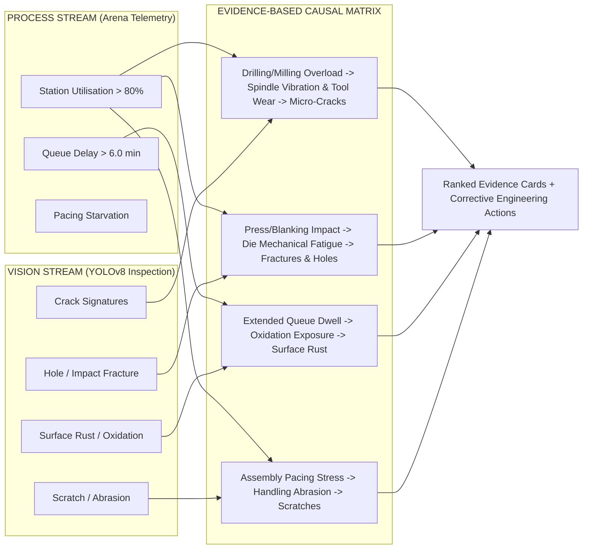
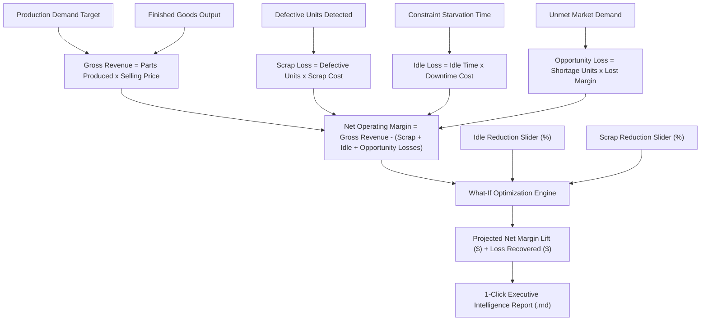

# Autonomous Quality & Process Intelligence Platform
## Complete Technical Architecture & System Flowcharts

---

## 1. High-Level End-to-End System Architecture

---

## 2. Detailed Subsystem Workflows

### Subsystem A: Computer Vision & Explainability Pipeline

---

### Subsystem B: Theory of Constraints (TOC) Telemetry Engine

---

### Subsystem C: Neural Digital Twin & Surrogate Pipeline

---

### Subsystem D: Root-Cause Causal Correlation Matrix

---

### Subsystem E: Financial Loss Waterfall & What-If Simulator

---

## 3. Technology & Latency Matrix

| Platform Subsystem | Core Technology | Mathematical / AI Model | Execution Latency |
| :--- | :--- | :--- | :--- |
| **Surface Inspection** | Ultralytics YOLOv8, PyTorch | Deep Convolutional Backbone + Softmax | ~12 ms / image |
| **Explainable Localization** | OpenCV, Grad-CAM Engine | Activation Map Gradient Backprop | ~18 ms / image |
| **Process Diagnostics** | Pandas, NumPy | Theory of Constraints (TOC), Little's Law | ~2 ms / dataset |
| **Digital Twin (ANN)** | Pure-Python Vectorized NumPy | 2-Layer Feedforward Net (10 Tansig Hidden) | **&lt; 0.05 ms** (Real-Time) |
| **Causal Correlation** | Rule Engine + Physics of Failure | Cross-Domain Evidence Mapping | ~1 ms |
| **Financial Engine** | Python Floating-Point Engine | Economic Loss Waterfall & Sensitivity | &lt; 0.5 ms |
| **Frontend UI** | Streamlit, Plotly, CSS3 Glassmorphism | Responsive Reactive Web App | 60 FPS Refresh |
